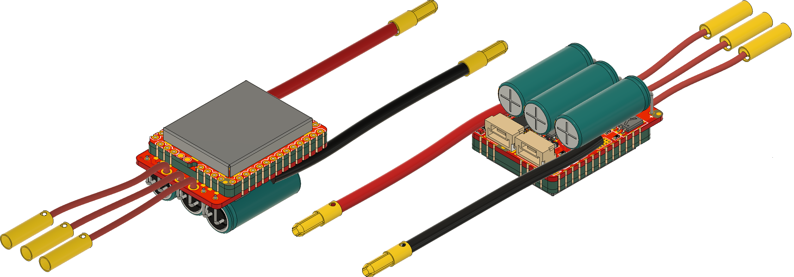
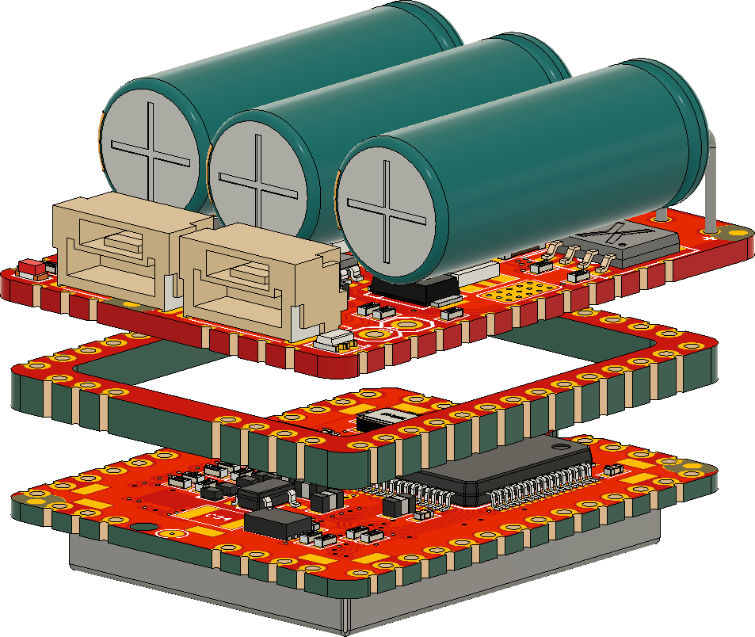
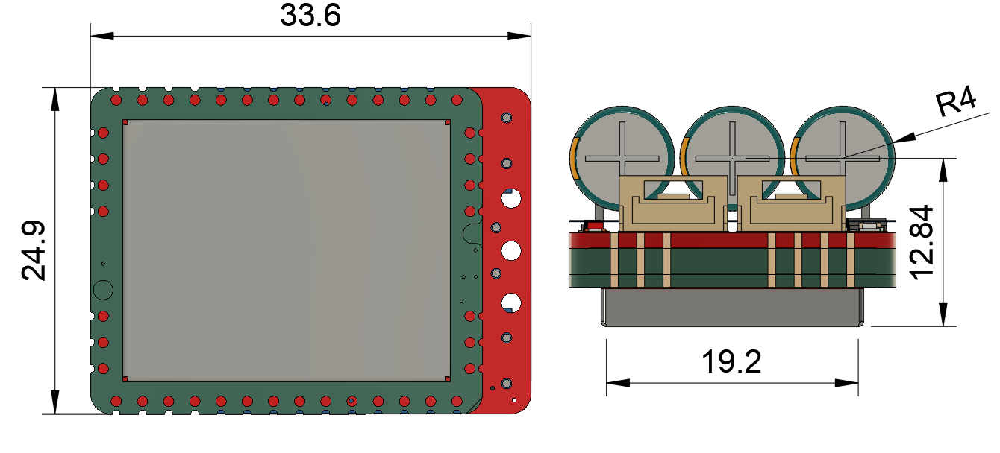

# Zubax Bloxa

## Overview

Zubax Bloxa is arguably the most compact practical ESC design based on the Mitochondrik module. The **key design requirements** for Bloxa are:

* Small size
* Low mass
* Low COG
* Compatible with the [UAVCAN hardware design recommendations](https://uavcan.org/specification)

## Brief specs

* Operating voltage range 4-8S Li-ion (LiCoO2) battery (12-34 V)
* Continuous power 200 W
* 1 UAVCAN interface
* Software controllable 5V 500 mA BEC output connected to UAVCAN 5 V line
* RC PWM input available on test pads (requires soldering)
* 36.6 x 24.9 linear dimensions

The main advantage of Bloxa is its miniature size. To achieve it, a novel Mitochondrik mounting technique is used.

Mitochondrik is mounted on the power stage PCB using an intermediary 2 mm thick PCB that basically serves as a connector.
Soldering is done using the edge connectors on the Mitochondrik, the intermediary  PCB, and the power stage PCB in the plane perpendicular to the PCB planes. 
Also, one of the RF shields on the Mitochondrik has not to be mounted (compatible Mitochondrik modules are available upon request, please contact Zubax Robotics).

High-reliability designs may prefer to avoid such unconventional approaches to ensure predictable mechanical characteristics.

## Power stage details.

Bloxa power stage uses three [BUK9K6R2-40E](https://www.digikey.com/products/en?keywords=1727-7274-1-ND) MOSFET arrays. 

| Parameter                                               | Value               |
| :------------------------------------------------------ | ------------------- |
| Drain to Source Voltage (Vds)                | 40 V                |
| Current - Continuous Drain (Id) @ 25°C       | 40 A                |
| Rds on (Max) @ Id, Vgs | 6 mOhm @ 25 A, 10 V |
| Gate Charge (Qg) (Max) @ Vgs      | 35.4 nC @ 10 V      |

The current shunt value is 10 mOhm.

The bulk capacitor bank is formed with 3 [180 µF aluminum electrolytic capacitors](https://www.digikey.com/products/en?keywords=565-4066-ND) from [United Chemi-Con](https://www.digikey.com/en/supplier-centers/u/united-chemi-con).

## Release notes
Newest entries at the top.
### Bloxa V0.2
* Current shunts replaced (5 mOhms replaced with 10 mOhms).
* Overcurrent protection added. Itrip is ~35 A.
* RCPWM through-hole connector replaced with smd solder pads.
* Power loss estimations table added to the schematic.
* TVS diode (D1) replaced with one that has lower breakdown voltage.

## License

This project is licensed under the terms of [CC-BY 4.0](https://creativecommons.org/licenses/by/4.0/).
