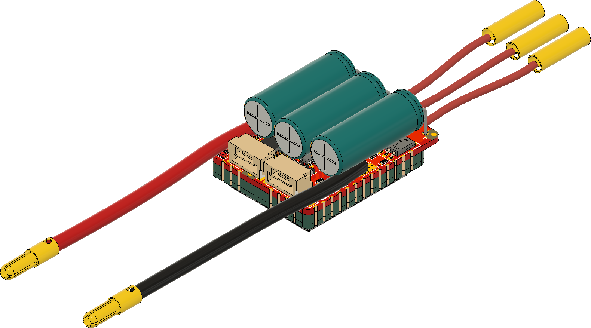
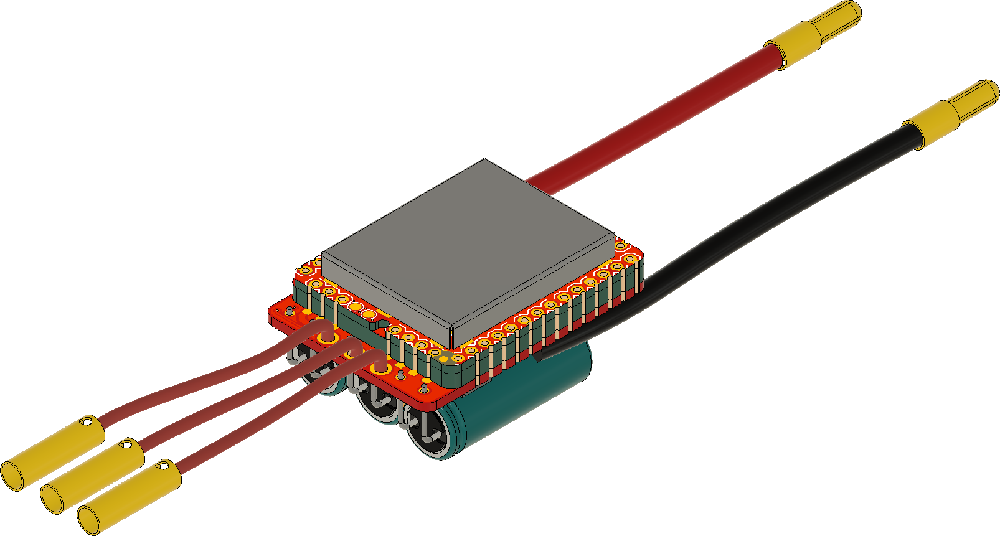
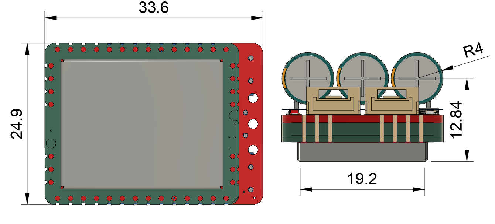

# Zubax Bloxa

## Overview

Zubax Bloxa is the most compact ESC design that is possible using Mitochondrik module(at least it seems to be it). The main design requirements for BLOXA are

* Small size
* Low mass
* Low COG
* [UAVCAN hardware recommendations](https://uavcan.org/Specification/8._Hardware_design_recommendations/) following

## Brief specs

* Operating voltage range 4-8S Li-Po (LiCoO2) battery (15-34 V)

* Continuous power 200W

* 1 UAVCAN interface

* Software controllable 5V 500mA BEC output connected to UAVCAN 5V line

* RC PWM input available on test-pads(requires soldering)

* 36.6 x 24.9 linear dimensions 

  The main advantage of BLOXA is its miniature size. To achieve it, a novel Mitochondrik mounting technique was used.

  

 
  Mitochondrik is mounted on the power stage PCB using intermediary 2mm thick PCB that basically serves as a connector. Soldering is done using edge connectors on the Mitochondrik, the intermediary  PCB and the power stage PCB in the plane perpendicular to the PCB planes.  Also, one of the RF shields on the Mitochondrik had to be removed. 
  
  Of course, this mounting technique seems questionable from the vibration resistance point of view, but it allows for the smallest PCB design possible. Bloxa has no strict reliability requirements, so this technique is acceptable. 
  
  
## Power stage details.

  Bloxa power stage uses three [BUK9K6R2-40E](https://www.digikey.com/products/en?keywords=1727-7274-1-ND) MOSFET arrays. 

| Parameter                                               | Value               |
| :------------------------------------------------------ | ------------------- |
| Drain to Source Voltage (Vds)                | 40 V                |
| Current - Continuous Drain (Id) @ 25°C       | 40 A                |
| Rds on (Max) @ Id, Vgs | 6 mOhm @ 25 A, 10 V |
| Gate Charge (Qg) (Max) @ Vgs      | 35.4 nC @ 10 V      |

  Current shunt value is 5 mOhm

  Bulk capacitor bank is formed with 3 [180µF  aluminum electrolytic capacitors](https://www.digikey.com/products/en?keywords=565-4066-ND) from [ United Chemi-Con](https://www.digikey.com/en/supplier-centers/u/united-chemi-con).

  Overcurrent protection trip value is set to ~47A using 1K resistor on OC_adj pin (R14). 

## License

This project is licensed under the terms of [CC-BY 4.0](https://creativecommons.org/licenses/by/4.0/).
